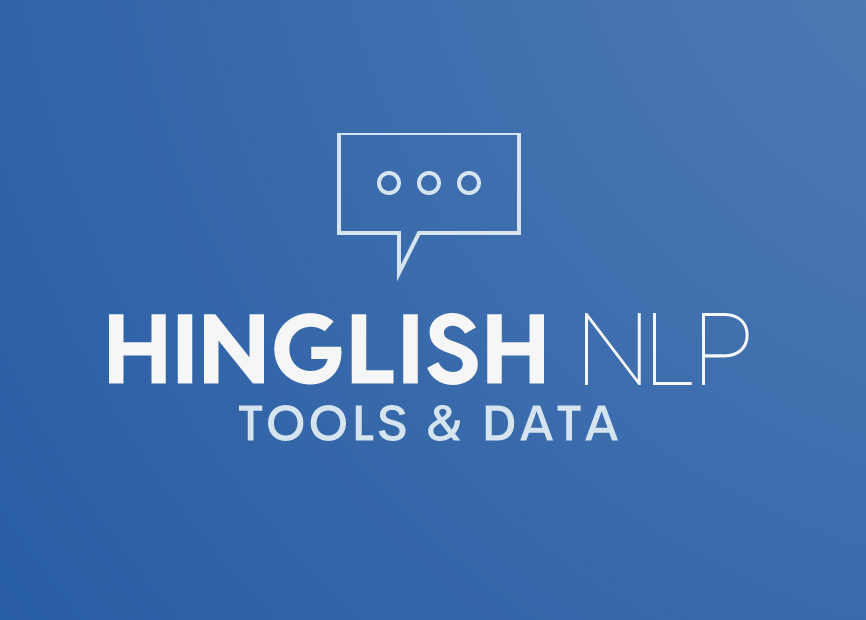

# Hinglish

Hinglish is a code-mixed dialect where Hindi (or Urdu) is typed in the Roman script. In this project, we build NLP tools for the same and make Hinglish processing easier than ever.

## Data

We begin with with a list of 1.4 Million tweets which we believe to have roughly 75-80% Hinglish tweets. Note that not all tweets are in this dialect, some are possible from other languages like Indonesian or Malaysian Bahasa. 

Broadly, this is our data procecssing flow:

1. Start with 1.4 Million tweets which we expect to be Hinglish. Here are their tweet ids
    - We expect roughly 20-25% of these 1.4M tweets to be non-Hinglish, e.g. Arabic, Indonesian Bahasa and Malaysian Bahasa.  
1. Find and mark 5K tweets manually which definitely are in Hinglish
1. 